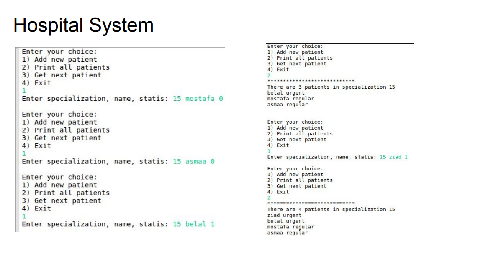
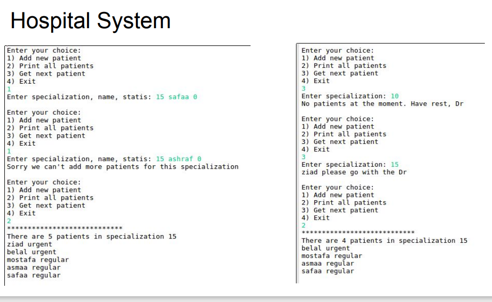
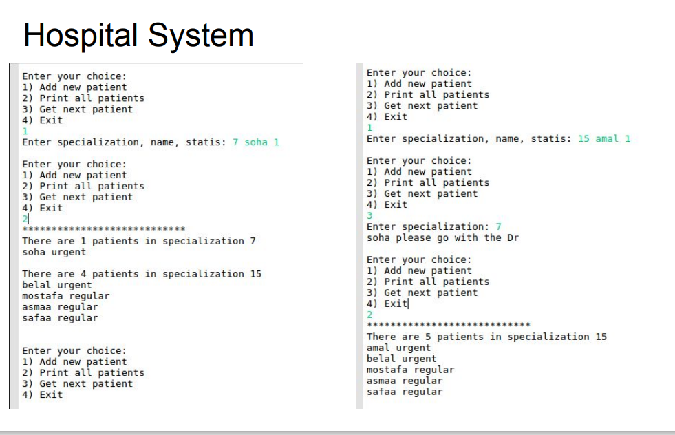

# Simple Hospital System

This project is a Simple project for c++ course made by mostafa saad
[mostafa saad course](https://www.udemy.com/share/103GjP3@_eq-Z3zHHeN4hIBrgPPEvcd0X7j4beWYQTKKd868tvNo5EcKzkPIxp04MUscpWMhTg==/)

## Main Features

In this project we have hospital with 20 specialization and every spicialization
have 5 patients or less.

Every patient has a name and status (normal , urgent)

You are not able to add new patient to specialization if there are 5 patient in this specialization.

### main fuctunality

- add new patient
- get the next patient when doctor asked
  - if there isn't patient return message to doctor "take a rest there isn't any patient"
- print all patiens in every spicialization if exist

## Screenshots For System Flow

screen 1

screen 2

screen 3

